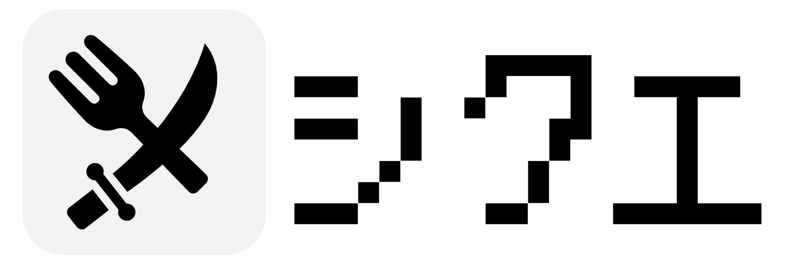
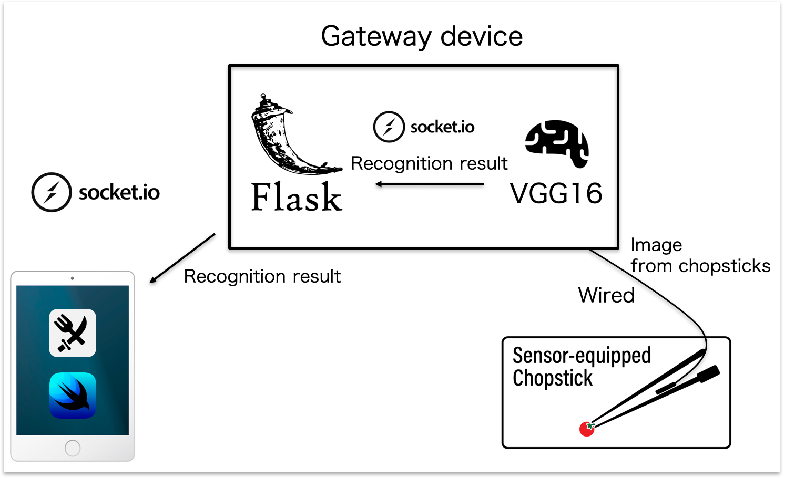

# M1-MeshiQue
研究室内のアプリコンテスト開発物．11人の中で最優秀賞をいただきました．


# 概要
食べたものを認識できる専用の箸でご飯を食べることで技が発生するRPGゲーム

# セットアップ
```
$ pod install
```
その後，xcworkspaceを開く

# システム構成図
箸に取り付けたカメラから取得した画像をゲートウェイデバイスに送り，ゲートウェイデバイス内にある深層学習モデルで認識します．その結果をローカルのwebサーバを介して本アプリに送信し，技が発生するといった流れになっています．(一応ボタンでも操作できるため，アプリ単体でも遊ぶことはできます)



# 通信方法
通信にはsocket.ioを使用しています．アプリはサーバ側から"from_chopstick"というイベントで技のコマンド(0~3)を受信します．コマンドに応じて以下の技が発生します．

* 0 -> こめ
* 1 -> たまご
* 2 -> さかな
* 3 -> 野菜
